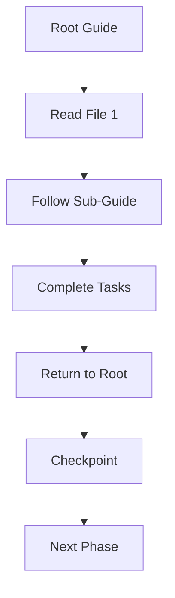

# TourGuide

**AI Navigation System for Codebases**

> TourGuide tells AI agents **WHERE to look** and **WHERE NOT to look**.  
> It does NOT generate answers, make decisions, or execute code.  
> **You create the guide. AI follows it.**

⚠️ **If you expect automatic discovery or code generation, this is not the tool.**

**Think of it as GPS:**
- You create the route → TourGuide stores it → AI follows it
- GPS doesn't drive → TourGuide doesn't code
- GPS prevents getting lost → TourGuide prevents AI overwhelm

> **Core Philosophy:**  
> TourGuide enforces a complete and ordered understanding of a project before allowing any interpretation or action.  
> It reduces hallucination not by adding intelligence, but by strictly defining **scope**, **sequence**, and **ignorance**.
> 
> **You are the expert. TourGuide is your knowledge template.**

**[Try the Demo →](DEMO-README.md)** (Show this to your AI assistant)

---

## What is TourGuide?

TourGuide is a **JSON-only navigation system** that guides AI agents through your codebase using interconnected guide files.

**What it does:**
- ✅ Provides sequential navigation paths (that **you create**)
- ✅ Defines what to read and in what order (that **you specify**)
- ✅ Sets completion checkpoints (that **you design**)
- ✅ Links to sub-guides for deep dives (that **you organize**)

**What it does NOT do:**
- ❌ Automatically discover your codebase structure
- ❌ Generate the guide file for you
- ❌ Generate code or solutions
- ❌ Make architectural decisions
- ❌ Execute tasks or run tests
- ❌ Analyze or interpret content
- ❌ Replace human or AI reasoning
- ❌ Guarantee correctness

**You are the cartographer. TourGuide is the map format.**

---

## How It Works



---

## Quick Start

⚠️ **Important**: TourGuide does NOT discover your codebase automatically. **You create the guide manually** (with AI help).

**Setup Process:**
1. **Copy a template** from `templates/` to your project root as `tourguide.json`
2. **Navigate your codebase with AI** - Ask your AI assistant to explore and understand your project structure
3. **Customize the guide together** - Update file paths, phases, and checkpoints based on what you learned
4. **Test it** - Show the completed guide to a fresh AI session and watch it navigate

**Think of it as creating a map:**
- You explore the terrain (with AI help)
- You draw the map (tourguide.json)
- Others use the map (AI agents follow it)

**Time investment**: 15-30 minutes for small projects, 1-2 hours for large codebases  
**Payoff**: Every future AI session starts with complete context

---

## Example Use Cases

- **AI Onboarding**: Get AI up to speed on your codebase
- **Large/Legacy Exploration**: Navigate complex codebases systematically
- **Context Freezing**: Lock understanding before refactors
- **Documentation Review**: Guide through documentation structure

---

## Common Mistakes

- **Skipping steps**: Trust the sequence, don't jump ahead
- **Treating as executor**: TourGuide navigates, doesn't do tasks
- **Mixing with interpretation**: Navigate first, interpret after

---

## Why TourGuide?

### The Problem
- You switch between AI assistants (Copilot, Cursor, Claude, etc.)
- New AI = explaining your codebase from scratch... again
- Onboarding a new AI takes time every session
- Different AIs get different information → inconsistent help
- AI agents get lost in large codebases
- They read random files
- They miss critical context
- They waste time on irrelevant code

### The Solution
1. Create TourGuide once (with AI help)
2. Share with ANY AI assistant
3. Instant context in a few moments
4. Consistent navigation for every AI session

**Think of it as:**
- GitHub → for version control
- TourGuide → for AI knowledge transfer

---

## Philosophy

TourGuide follows the **"origin.md"** principle:
- **No pressure** — navigation, not enforcement
- **No rigid rules** — guidance, not law
- **No punishment** — structure, not restriction
- **Just a map** — shows terrain, doesn't force route

**And the map:**
- **Doesn't tell you the way** — you choose your path
- **But shows you the cliff** — warns of danger zones

---

## Try the Demo

The best way to understand TourGuide is to see it in action:

1. Open `DEMO-README.md`
2. Show it to your AI assistant
3. Watch it navigate through this project

**Expected outcome:** Your AI will systematically explore TourGuide, following the guide's instructions.

---

## Documentation

- **[Getting Started Guide](docs/GUIDE.md)** - Detailed usage instructions
- **[JSON Schema Reference](docs/SCHEMA.md)** - Technical specification

---

## Project Structure

```
tourguide/
├── README.md              # This file
├── LICENSE                # Apache 2.0
├── DEMO-README.md         # Show this to your AI
├── tourguide.json         # Self-describing demo guide
├── templates/             # Ready-to-use templates
│   ├── minimal.json
│   ├── standard.json
│   └── codebase.json
├── examples/              # Real-world examples
│   ├── python-app/
│   └── docs-site/
└── docs/                  # Documentation
    ├── GUIDE.md
    └── SCHEMA.md
```

---

## License

Apache 2.0 - Open source with patent protection

---

## Status

🚧 **Development** - Part of Blueprint Universal AI Tool System  
📍 **Location**: `projects/indirect/tourguide/`  
🎯 **Spin-off**: Planned for standalone GitHub repository

---

**TourGuide is intentionally minimal. If it feels restrictive, it is working as designed.**
